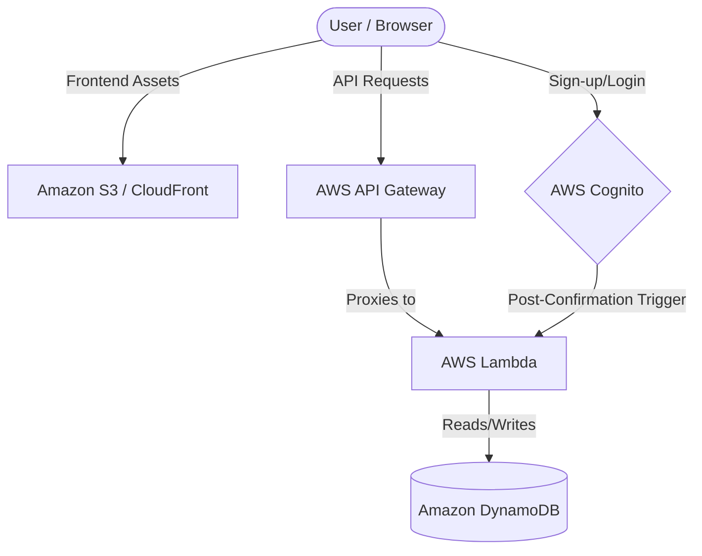

# SPECTRUM AI Tutor

A minimalist, high-performance serverless learning management platform. This project leverages a 100% serverless architecture for maximum scalability and zero maintenance overhead.

## 🏗 Architecture Design Pattern



### Resource Communication Flow:
1.  **Identity**: Users authenticate via **AWS Cognito**. Upon successful sign-up, a **Post-Confirmation Lambda** trigger automatically initializes their profile in the database.
2.  **Traffic**: The **Vanilla JS Frontend** communicates with **AWS API Gateway** for all dynamic data operations.
3.  **Logic**: **AWS Lambda** functions (Python 3.12) handle the business logic, decoupled from the frontend.
4.  **Storage**: **Amazon DynamoDB** serves as the persistent NoSQL storage layer for user profiles and academic data.

---

## 🛠 Direct Implementation & Security

This project follows the "Zero Hardcoding" principle. All critical configurations and credentials are externalized:

-   **AWS Profile**: The infrastructure and SDKs use the **predefined `default` AWS profile**. No `access_key` or `secret_key` are stored in the codebase.
-   **Environment Injection**: Resources are identified dynamically. API URLs and Database endpoints are managed through Terraform outputs and runtime environment variables.
-   **Infrastructure as Code**: The entire stack is provisioned using **Terraform**, ensuring environment parity and repeatable deployments.

---

## 💰 AWS Cost Breakdown (Free Tier Optimized)

| Service | Component | Free Tier Limit | Estimated Cost ($/mo) |
| :--- | :--- | :--- | :--- |
| **Cognito** | User Pool | 50,000 MAUs | **$0.00** |
| **Lambda** | Logic Processing | 1 Million requests / mo | **$0.00** |
| **DynamoDB** | Data Storage | 25 GB Storage | **$0.00** |
| **API Gateway** | HTTP/REST API | 1 Million calls / mo | **$0.00** |
| **S3/CloudFront** | Hosting | 1 TB Data Transfer Out | **$0.00** |

---

## 🚀 Deployment

This project is configured for **Local Development** with Cognito-Local and LocalStack.

1.  **Configure AWS CLI**:
    ```bash
    # Ensure your default profile has dummy credentials for local use
    aws configure --profile default
    # Access Key ID: test
    # Secret Access Key: test
    # Region: us-east-1
    ```
2.  **Start Local Services**:
    Ensure **LocalStack** and **Cognito-Local** (port 9229) are running.

3.  **Apply Terraform**:
    Use standard Terraform (not `tflocal`) as the provider is already configured to handle the split between LocalStack and Cognito-Local:
    ```bash
    terraform init
    terraform apply
    ```
4.  **Sync Frontend**:
    Run the sync script to update `app.js` and `auth.js` with the local resource IDs:
    ```bash
    ./sync-api.sh
    ```


---
**SPECTRUM AI Tutor** - *Secure, Scalable, and Serverless.*

