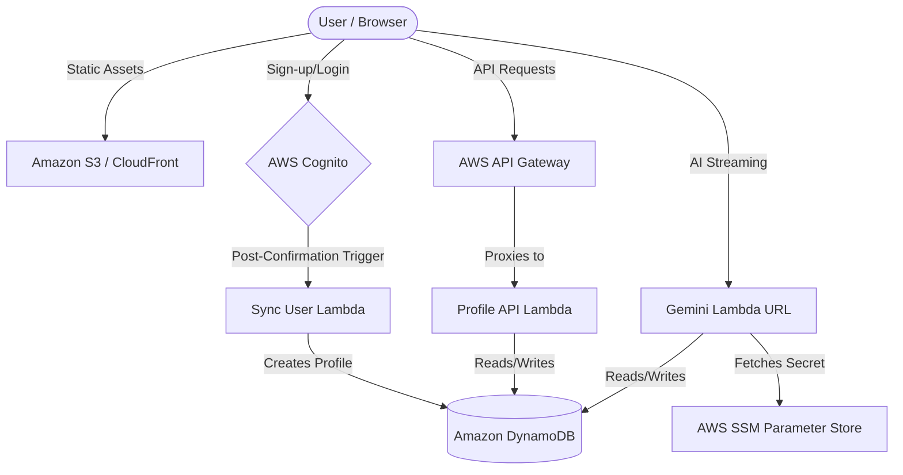

# SPECTRUM AI Tutor

> **A secure, serverless AI-powered learning management platform built with security-first principles.**

SPECTRUM AI Tutor is a high-performance, 100% serverless educational platform that leverages Google's Gemini AI for real-time, personalized tutoring. It combines enterprise-grade AWS security with an intuitive learning experience.

---

## 🔐 Security Architecture (Best Practices)

Security is the cornerstone of this application. Every layer—from authentication to data storage—implements AWS-recommended best practices.

### 1. Secret Management (Zero Hardcoding)

| Principle | Implementation |
| :--- | :--- |
| **No Secrets in Code** | The Gemini API key is **never** stored in source code. It's securely held in **AWS Systems Manager Parameter Store** as a `SecureString`. |
| **Runtime Retrieval** | The Lambda function fetches the key at runtime using `ssm.get_parameter(WithDecryption=True)`, decrypting it only when needed. |
| **IAM Scoped Access** | The Lambda execution role has a tightly scoped policy granting access *only* to `/smart-ai-tutor/*` parameters. |

```terraform
# Secure parameter storage (lambda.tf)
resource "aws_ssm_parameter" "gemini_key" {
  name  = "/smart-ai-tutor/gemini-api-key"
  type  = "SecureString"            # Encrypted at rest with AWS KMS
  value = var.gemini_api_key        # Injected via terraform.tfvars (gitignored)
}
```

### 2. Authentication & Authorization

The application uses **AWS Cognito** for user identity, configured with enterprise-grade policies:

| Security Feature | Configuration |
| :--- | :--- |
| **Strong Password Policy** | Min 12 chars, requires uppercase, lowercase, numbers, AND symbols |
| **Email Verification** | Mandatory email confirmation via one-time code before account activation |
| **Token Expiration** | Access tokens expire in **1 hour**; ID tokens in **1 hour**; Refresh tokens in **30 days** |
| **User Existence Errors** | `prevent_user_existence_errors = "ENABLED"` - Attackers cannot enumerate valid emails |
| **Role-Based Access Control** | `custom:job_title` attribute separates Learners from Tutors; verified on every login |

```javascript
// Role verification at login (auth.js)
if (userJob !== selectedJob) {
    cognitoUser.signOut();
    return alert(`Access Denied`);
}
```

### 3. Infrastructure Security (Terraform IaC)

- **No Hardcoded Credentials**: AWS access relies on named profiles (e.g., `capaciti`), not embedded access keys.
- **Least Privilege IAM**: Lambda roles are granted the minimum permissions required (DynamoDB CRUD, SSM read).
- **Environment Parity**: All infrastructure is defined as code, ensuring consistent and auditable deployments.

### 4. Data Protection

- **DynamoDB On-Demand**: Pay-per-request mode eliminates over-provisioning while maintaining encryption at rest by default.
- **Client-Agnostic CORS**: API Gateway and Lambda Function URLs are configured with explicit CORS headers.

---

## 🏗 System Architecture



### Resource Communication Flow

1.  **Identity**: Users authenticate via **AWS Cognito**. Upon successful sign-up, a **Post-Confirmation Lambda** trigger automatically initializes their profile in DynamoDB.
2.  **Profile & Data**: The **Profile API Lambda** handles all CRUD operations for user profiles, subjects, lessons, and enrollments via **API Gateway**.
3.  **AI Tutoring**: The **Gemini Lambda** (FastAPI + Mangum) provides real-time streaming chat, quiz generation, and assessment grading via a **Lambda Function URL**.
4.  **Storage**: **Amazon DynamoDB** (3 tables: `UserProfiles`, `Subjects`, `Lessons`) serves as the persistent NoSQL data layer.

---

## ✨ Application Features

### AI-Powered Learning

| Feature | Description | Endpoint |
| :--- | :--- | :--- |
| **Real-Time AI Chat** | Gemini 2.5 Flash provides streaming, context-aware tutoring | `POST /chat-stream` |
| **Multimodal Input** | Learners can attach images (e.g., a photo of a problem) for AI analysis | (via chat) |
| **Quiz Generation** | AI generates a 5-question MCQ quiz based on the lesson conversation | `POST /generate-quiz` |
| **Automated Grading** | AI grades quiz attempts and provides detailed feedback | `POST /grade-quiz` |
| **Session Persistence** | Chat history is stored in DynamoDB, eliminating "AI amnesia" across sessions | (automatic) |

### User Management

| Feature | Description | Endpoint |
| :--- | :--- | :--- |
| **Profile Management** | Learners can set their name, surname, grade, and curriculum (CAPS/IEB) | `GET/POST /profile` |
| **Subject Enrollment** | Browse available subjects and enroll with a single click | `POST /enroll` |
| **Topic Management** | Tutors can add topics to subjects (term, name, description) | `POST /topics` |
| **Learning Statistics** | Aggregate quiz scores per subject to track progress | `GET /stats` |

### Lesson Lifecycle

| Feature | Description | Endpoint |
| :--- | :--- | :--- |
| **Start Lesson** | Creates a new lesson record linked to the user, topic, and subject | `POST /lessons/start` |
| **Chat & Learn** | Persist user messages during the AI conversation | `POST /lessons/chat` |
| **Complete Lesson** | Marks a lesson as completed for review later | `POST /lessons/complete` |
| **Review Past Lessons** | Fetch completed lessons by topic or individual lesson ID | `GET /lessons` |

### Frontend Capabilities

- **WhatsApp-Style Chat UI**: Modern, responsive chat interface with message bubbles and typing indicators.
- **Voice Input**: Speech-to-text via Web Speech API for hands-free learning.
- **Dark Mode Dashboard**: Sleek, modern learner dashboard with circular navigation and stat cards.
- **Role Selection**: Learner/Tutor toggle at login with appropriate access restrictions.

---

## 💰 AWS Cost Breakdown (Free Tier Optimized)

All services are configured to stay within AWS Free Tier limits for typical usage:

| Service | Component | Free Tier Limit | Estimated Cost ($/mo) |
| :--- | :--- | :--- | :--- |
| **Cognito** | User Pool | 50,000 MAUs | **$0.00** |
| **Lambda** | Logic Processing | 1 Million requests / mo | **$0.00** |
| **DynamoDB** | Data Storage | 25 GB Storage, 25 WCU/RCU | **$0.00** |
| **API Gateway** | HTTP/REST API | 1 Million calls / mo | **$0.00** |
| **SSM Parameter Store** | Secret Storage | 10,000 standard parameters | **$0.00** |
| **S3/CloudFront** | Hosting | 1 TB Data Transfer Out | **$0.00** |

---

## 🚀 Deployment Guide

### Prerequisites

- AWS CLI configured with a profile (e.g., `default` or `capaciti`)
- Terraform >= 1.0
- Python 3.12
- A valid **Gemini API Key** from Google AI Studio

### 1. Clone and Configure Secrets

```bash
git clone https://github.com/dingaanmanjate/Smart-AI-Tutor.git
cd Smart-AI-Tutor

# Create your secrets file (NEVER commit this)
echo 'gemini_api_key = "YOUR_GEMINI_API_KEY"' > terraform.tfvars
echo 'aws_profile = "your-profile-name"' >> terraform.tfvars
echo 'aws_region = "af-south-1"' >> terraform.tfvars
```

### 2. Deploy Infrastructure

```bash
terraform init
terraform apply
```

### 3. Sync Frontend Configuration

After deployment, update the frontend with the generated API endpoints:

```bash
./sync-api.sh
```

### 4. Serve Locally

Open `index.html` in a browser or use a local HTTP server:

```bash
python3 -m http.server 8888
# Navigate to http://localhost:8888
```

---

## 📁 Project Structure

```
Smart-AI-Tutor/
├── index.html              # Login page
├── dashboard.html          # Learner dashboard
├── style.css               # UI styles (dark theme)
├── app.js                  # Core frontend logic
├── auth.js                 # Cognito authentication
├── gemini_handler.py       # AI streaming Lambda (FastAPI)
├── profile_handler.py      # Profile/Subjects/Lessons Lambda
├── process_user.py         # Cognito post-confirmation sync
├── cognito.tf              # Cognito User Pool config
├── lambda.tf               # Lambda + API Gateway + SSM
├── dynamo.tf               # DynamoDB tables
├── frontend.tf             # S3/CloudFront (optional)
├── providers.tf            # AWS provider config
├── sync-api.sh             # Script to inject API URLs
├── package_gemini.py       # Builds Gemini Lambda zip
├── requirements.txt        # Python dependencies
└── .gitignore              # Excludes secrets, .terraform, etc.
```

---

## 🛡️ Security Checklist (Implemented)

- [x] Passwords require 12+ characters with mixed case, numbers, and symbols
- [x] Email verification required before account activation
- [x] API keys stored in SSM Parameter Store (SecureString)
- [x] Lambda IAM roles follow least-privilege principle
- [x] No secrets or credentials in source code
- [x] Terraform state excluded from version control
- [x] User enumeration protection enabled on Cognito
- [x] Short-lived access tokens (1 hour expiry)
- [x] CORS explicitly configured per endpoint

---

**SPECTRUM AI Tutor** — *Secure, Scalable, and Serverless.*
